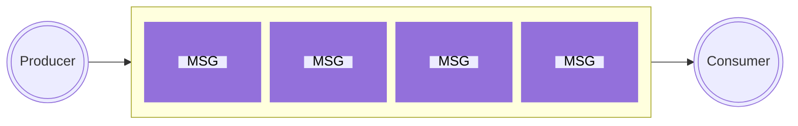

# RABBITMQ

Este projeto faz parte de um série de estudos dedicados ao RABBITMQ.

## Índice

- [O que é RabbitMQ](#o-que-é-o-rabbitmq)
- [Sobre o projeto](#sobre-o-projeto)
- [Tecnologias utilizadas](#tecnologias-utilizadas)
- [Requisitos](#requisitos)
- [Preparando o ambiente](#preparando-o-ambiente)
- [Como executar](#como-executar)
- [Entendendo a aplicação](#entendendo-a-aplicação)
- [Considerações Finais](#considerações-finais)
- [Referências](#referências)

## O que é o RabbitMQ?

É um software de mensageria de código aberto que implementa o protocolo Advanced Message Queuing Protocol (AMQP). Ele atua como um intermediário entre aplicativos que precisam se comunicar, permitindo que eles troquem mensagens de forma assíncrona.

O RabbitMQ funciona como um "encaminhador de mensagens, ou seja, ele recebe as mensagens de um aplicativo, as armazena em filas e as encaminha para outro aplicativo. Ele oferece recursos como filas persistentes, garantias de entrega de mensagens e gerenciamento de filas, permitindo que os desenvolvedores criem aplicativos escaláveis e robustos.

## Sobre o Projeto

Este é o primeiro projeto de uma série de estudos dedicados para RabbitMQ.
Os projetos foram desenvolvidos principalmente através dos tutoriais do próprio RabbitMQ.
Como em sua própria página diz, estes são apenas tutoriais, não sendo todo o conteúdo necessário para se usar em produção.

## Tecnologias utilizadas

- [RabbitMQ](https://www.rabbitmq.com/)
- Node.js
- Javascript
- [Docker](https://www.docker.com/)
- Docker-compose
- amqplib

## Requisitos

Para executar este projeto existem alguns requisitos mínimos:

1. Node.js
2. Docker

## Preparando o ambiente

Primeiro é necessário ter instalado o [Node.js](https://nodejs.org/).

Agora o próximo passo para preparar nosso ambiente é o próprio RabbitMQ.
Este pode ser configurado de diversas maneiras.

1. Você pode baixar e instalar o RabbitMQ diretamente em sua máquina, este [link](https://www.rabbitmq.com/download.html) o levará à página oficial de download e instruções.

2. Você pode usar o docker para baixar uma imagem e executar um container com o rabbitMQ em sua máquina. Caso já tenha o docker instalado, basta executar o seguinte comando em um terminal:

```bash
#este comando irá baixar e executar a última versão do rabbitMQ

docker run -it --rm --name rabbitmq -p 5672:5672 -p 15672:15672   rabbitmq:management

```

3. Este passo é necessário ter instalado tanto o docker, quanto o [docker compose](https://docs.docker.com/compose/install/), no próprio diretório do projeto já há um arquivo docker-compose.yml com instruções que irão baixar a última imagem do rabbitMQ e executar o container, configurar as portas e o nome do container. Então basta executar o seguinte comando:

```bash
#execute este comando no diretório do projeto

docker-compose up

```

## Como executar

Com o ambiente preparado, o rabbitMQ em execução, baixe ou clone este projeto em sua máquina. Para clonar execute o comando a seguir:

```bash
https://github.com/AnaniasBarbosa/hello-rabbitmq.git
```

Após o download estar completo execute o seguinte comando para entrar no diretório que acabou de ser criado:

```bash
cd hello-rabbitmq
```

Também é necessário instalar as dependências:

```bash
#caso você utilize NPM
npm install
```

A melhor maneira de visualizar este projeto em execução é ter duas instâncias de um terminal abertas. Pois em uma você enviará as mensagens e em outra visualizará as mensagens chegando logo após serem enviadas.

1. Primeiro devemos executar o arquivo que envia as mensagens para nossa **fila**, você fará isso executando o seguinte comando:

```bash
#este comando executará o arquivo send.js

node src/send.js
```

OBS: deve aparecer em sua janela do terminal a seguinte mensagem:

```bash
[x] Sent Hello world

#caso não apareça esta mensagem certifique de que está executando o container do RabbitMQ e instalou as dependências do projeto.
```

Pronto, nossa mensagem **_Hello word_** foi enviada, mas quem vai receber?

O próximo arquivo que vamos executar é reponsável por receber as mensagens. Vamos poder ver as coisas funcionando hehehe.

Execute o comando:

```bash
#executará o arquivo que receberá as mensagens
node src/receive.js
```

E você poderá visualizar a mensagem **_Hello word_** no console. Pode testar a vontande, execute o arquivo send.js quantas vezes quiser, e você visualizará a mensagem diversas vezes. Pode inclusive parar a execução do arquivo **receive.js** utilizando o comando **CTRL + C**, executar o arquivo de envio **n** vezes e depois executar novamente o arquivo **receive.js** você perceberá que todas as mensagens na **fila** foram lidas.

## Entendendo a aplicação

Como explicado anteriormente o RabbitMQ é como um encaminhador de mensagens.

Para entender alguns termos utilizados e como o RabbitMQ funciona vamos dar um exemplo:

Imagine que você precise enviar uma carta à um amigo que mora em outra cidade, você usaria uma agência postal para este fim. A agencia colocaria a carta em uma **_fila_**, o carteiro seria o responsável por entregar a carta no endereço informado e seu amigo receberia a carta.

- As cartas ficam organizadas em **_filas_** de acordo com suas cidades de destino, onde aguardam sua vez para para serem entregues.

- RabbitMQ seria a agência e o carteiro neste exemplo.

- Você, o responsável por levar a carta à agencia, seria o **_Producer_**.

- O seu amigo aquele que recebeu a carta seria o **_Consumer_**.

</br>
</br>



</br>
</br>

Como pode ser visto no gráfico o **_producer_** envia a mensagem para a **_fila_**, então ela aguarda sua vez para ser encaminhada ao **_consumer_**.

</br>
</br>

## Considerações finais

Vimos aqui um exemplo muito, mas muito básico do RabbitMQ, mas com isso podemos imaginar diversas possibilidades para aplicar esta tecnologia. Tais como um serviço de notificações, onde a aplicação precisa ficar "ouvindo" novas atualizações. Análises de dados em tempo real, entre outros diversos casos de uso.

</br>

## Referências

Tutorial RabbitMQ Hello Word </br>
Disponível em: [tutorial oficial](https://www.rabbitmq.com/tutorials/tutorial-one-javascript.html)
